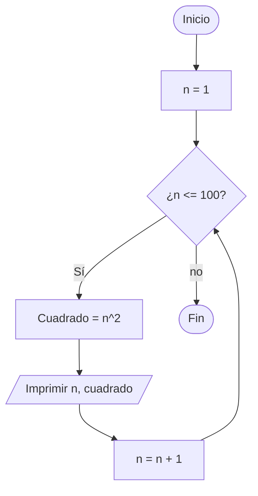
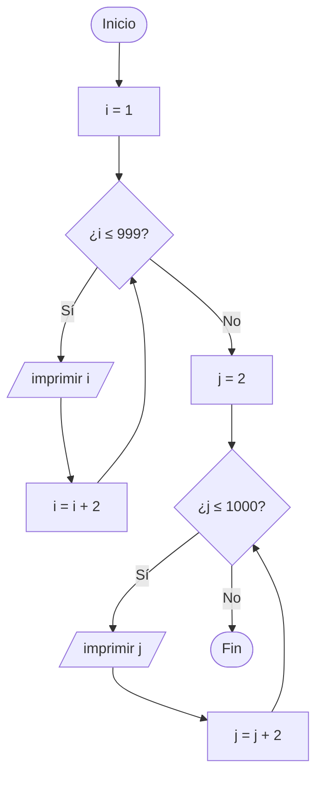
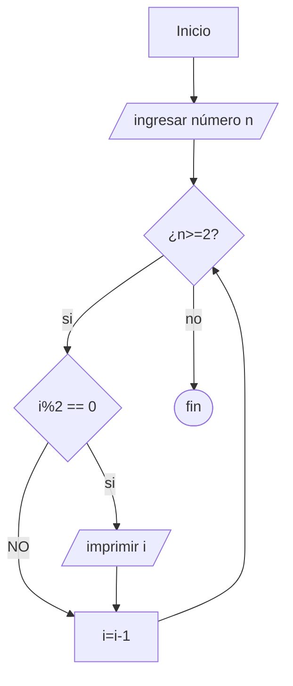

# RETO-6
### 1. Imprimir un listado con los números del 1 al 100 cada uno con su respectivo cuadrado.
```python 
# Inicializar variable
i = 1  # Comienza en 1

# Bucle while para recorrer del 1 al 100
while i <= 100:
    # Imprime el número y su cuadrado
    print(f"El cuadrado de {i} es {i**2}")
    
    # Incrementa el contador en 1 para pasar al siguiente número
    i += 1


```




### 2. Imprimir un listado con los números impares desde 1 hasta 999 y seguidamente otro listado con los números pares desde 2 hasta 1000.
```python
# Imprimir números impares del 1 al 999
print("Números impares del 1 al 999:")
i = 1  # Comenzamos con el primer número impar
while i <= 999:
    print(i)      # Imprime el número impar actual
    i += 2        # Avanza al siguiente número impar sumando 2

# Imprimir números pares del 2 al 1000
print("Números pares del 2 al 1000:")
j = 2  # Comenzamos con el primer número par
while j <= 1000:
    print(j)      # Imprime el número par actual
    j += 2        # Avanza al siguiente número par sumando 2

```

primero hace la lista de los números impares y luego la de los pares 


### 3. Imprimir los números pares en forma descendente hasta 2 que son menores o iguales a un número natural n ≥ 2 dado
```python
# Solicita al usuario que ingrese un número entero
n = int(input("Ingrese un número: "))

# Verifica si el número ingresado es mayor o igual a 2
if n >= 2:
    print("Los números pares son:")

    # Bucle que recorre desde n hasta 1, en orden descendente
    for i in range(n, 0, -1):

        # Verifica si el número es par
        if i % 2 == 0:
            print(i)  # Imprime el número si es par

```


        
### 4. Imprimir el factorial de un número natural n dado.
```python
# Solicita al usuario que ingrese un número entero positivo
n = int(input("Ingrese el número entero positivo: "))

# Inicializa la variable factorial con 1 (neutro multiplicativo)
factorial = 1

# Bucle que recorre desde 1 hasta n (incluido)
for i in range(1, n + 1):
    factorial *= i  # Multiplica factorial por i en cada iteración

# Imprime el resultado del factorial
print(f"El factorial de {n} es {factorial}")

```  
### 5. Implementar un programa que ingrese un número de 2 a 50 y muestre sus divisores.
```python
# Solicita al usuario que ingrese un número entre 2 y 50
n = int(input("Ingrese un número entre 2 y 50: "))

# Imprime encabezado explicativo
print(f"Los divisores de {n} son:")

# Bucle que recorre desde n hasta 1 en orden descendente
for i in range(n, 0, -1):
# Verifica si i es divisor de n (es decir, si n dividido por i no deja residuo)
if n % i == 0:
    print(i)   # Si es divisor, lo imprime
```
### 6. Implementar el algoritmo que muestre los números primos del 1 al 100.
```python
# Define una función que determina si un número 'n' es primo
def numero_primo(n):
    # Los números menores que 2 no son primos
    if n < 2:
        return False

    # Recorre los números desde 2 hasta la raíz cuadrada de n (inclusive)
    # Si n es divisible por alguno de estos, no es primo
    for i in range(2, int(n**0.5) + 1):
        if n % i == 0:
            return False  # n tiene un divisor, no es primo

    return True  # n no tuvo divisores, es primo

# Imprime un encabezado
print("Números primos del 1 al 100:")

# Recorre los números del 1 al 100
for i in range(1, 101):
    # Llama a la función para verificar si 'i' es primo
    if numero_primo(i):
        print(i)  # Si es primo, lo imprime

```
